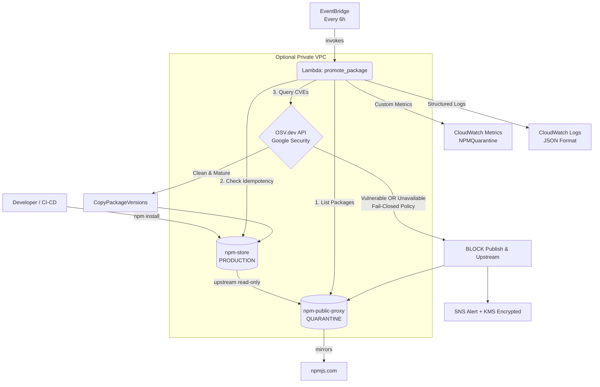
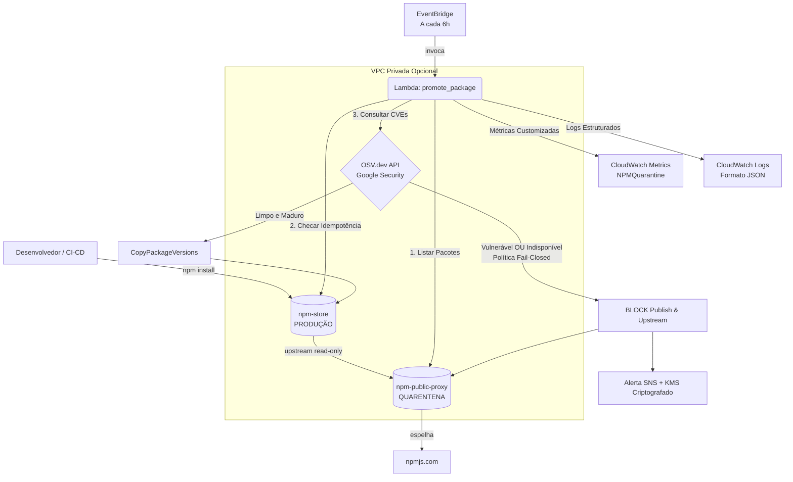

# 🔒 AWS npm Quarantine (v2.0 DevSecOps Edition)

[](#english) [](#português)

---

<a name="english"></a>
# 🇺🇸 English

Internal npm package proxy with **automatic quarantine & vulnerability scanning** via AWS CodeArtifact + OSV.dev API (Google Open Source Vulnerabilities).

Blocks malicious packages or those with known CVEs **before** they reach developers or CI/CD pipelines.

---

## Architecture & DevSecOps Flow



---

## 🛠️ Technical Decisions & Architectural Rationale

### 1. Vulnerability Scanner: OSV.dev vs. Amazon Inspector v2 vs. Commercial Scanners
* **The Problem:** Amazon Inspector v2 scans EC2 instances, ECR container images, and Lambda function code — but **does not natively scan CodeArtifact repositories**. Querying Inspector v2 for CodeArtifact npm packages returns zero findings, creating a false sense of security.
* **The Decision:** Integrated **OSV.dev (Google Open Source Vulnerabilities)** via direct HTTPS REST API.
* **Why OSV.dev?**
  * **Authoritative & Real-time:** Aggregates CVEs, NVD, GitHub Advisory Database, and npm security advisories. Updated continuously by Google Security Team.
  * **Zero Operational Cost & Credentials:** Open API with no API key management or third-party vendor lock-in.
  * **Pluggable Architecture:** Code is structured so OSV.dev can be complemented or replaced with Snyk or Socket.dev if commercial deep-malware analysis is required later.

### 2. Security Posture: Fail-Closed Default (`OSV_FAIL_OPEN=false`)
* **The Decision:** If the OSV API is unreachable (network degradation, API downtime, or timeout), the system assumes the package is **potentially vulnerable** and **blocks promotion**.
* **Rationale:** In software supply chain security, unverified code must *never* flow silently into production proxy repositories. A temporary delay in package promotion is preferable to an unvetted package exposure. An `OSVUnavailableCount` CloudWatch alarm notifies the security team immediately.

### 3. Idempotency Guard & State Synchronization
* **The Problem:** Re-evaluating already-promoted versions every 6 hours causes duplicate AWS API calls and generates `ResourceAlreadyExistsException` noise in logs.
* **The Decision:** The Lambda queries `npm-store` (production repo) first via `get_versions_in_dest()`. Any version already present in `npm-store` is immediately skipped from evaluation.
* **Benefit:** Reduces execution time by >80% on populated repositories and ensures clean, signal-rich execution logs.

### 4. Encryption & Key Management (KMS CMK)
* **The Decision:** Provisioned a single dedicated AWS KMS Customer Managed Key (`aws_kms_key.quarantine`) with annual automatic key rotation enabled.
* **Scope:** Enforces encryption at rest across CodeArtifact Domain, SQS Dead Letter Queue, SNS Topic, and CloudWatch Log Group.
* **Least-Privilege Key Policy:** Grants explicit encryption/decryption rights only to the Lambda Role, CloudWatch Alarms service, and CloudWatch Logs service, adhering to SOC2 and ISO 27001 compliance guidelines.

### 5. Observability: JSON Structured Logs & Custom CloudWatch Metrics
* **Structured JSON Logging:** Logs emit strict JSON schemas via `_log()` helper. This enables zero-overhead filtering in CloudWatch Logs Insights (e.g., `fields @timestamp, event, package, version | filter event = "package_blocked"`).
* **Custom Metrics:** Publishes real-time metrics under namespace `NPMQuarantine`:
  * `PackagesPromoted` (counter)
  * `PackagesBlocked` (counter)
  * `QuarantineQueueDepth` (gauge)
  * `OSVQueryLatencyMs` (timer)
  * `OSVUnavailableCount` (alarm trigger)

### 6. Network Isolation: Optional Private VPC & Endpoints
* **The Decision:** Implemented `infra/vpc.tf` with `create_vpc` toggle (default `false` for dev, `true` for prod).
* **Private Subnets & NAT GW:** When enabled, Lambda executes inside private subnets. Outbound traffic to `api.osv.dev` passes through NAT Gateway.
* **Interface VPC Endpoints:** All AWS service calls (CodeArtifact API/Repos, SNS, SQS, CloudWatch, X-Ray) stay entirely within the AWS internal network backbone via PrivateLink.

### 7. Continuous Integration Quality Gates (CI/CD)
* **Quality Pipeline:** GitHub Actions workflow (`.github/workflows/ci.yml`) enforces:
  * Unit testing with `pytest` and 80%+ code coverage requirement (`pytest-cov`).
  * Python linting & strict type checking via `ruff` and `mypy`.
  * IaC static security analysis using **Checkov** and **tfsec**.
  * Automated `terraform plan` comments on Pull Requests using GitHub OIDC authentication.

---

## 📊 Infrastructure Resource Matrix

| Resource | Description | Security / Encryption |
|---|---|---|
| `aws_kms_key.quarantine` | Customer Managed Key (CMK) with annual rotation | KMS CMK (AES-256) |
| `aws_codeartifact_domain` | Central CodeArtifact domain | KMS CMK Encrypted |
| `aws_codeartifact_repository.npm_proxy` | Quarantine repository mirroring npmjs.com | Direct dev publish DENIED |
| `aws_codeartifact_repository.npm_store` | Production repository used by developers | Upstream read-only from proxy |
| `aws_lambda_function.promote_package` | Promotion/blocking logic engine | Execution role least-privilege, X-Ray enabled |
| `aws_sqs_queue.lambda_dlq` | Dead Letter Queue (14-day retention) | KMS CMK Encrypted |
| `aws_sns_topic.quarantine_alerts` | Alert notification channel | KMS CMK Encrypted, DenyAllOtherPublish policy |
| `aws_cloudwatch_log_group` | Structured execution logs | KMS CMK Encrypted, configurable retention |
| `aws_vpc` + VPC Endpoints | Dedicated network isolation | Private subnets, Security Groups HTTPS outbound only |

---

## 🚀 Quick Start & Deployment

```bash
# 1. Clone & enter repository
cd aws-npm-quarantine

# 2. Configure variables
cp infra/terraform.tfvars.example infra/terraform.tfvars
# Edit infra/terraform.tfvars as needed

# 3. Test & Deploy via Makefile
make deploy
```

## 💻 Usage by Developers

```bash
# Authenticate npm against internal repository (valid for 12h)
make npm-login

# Or run AWS CLI directly:
aws codeartifact login \
  --tool npm \
  --domain minha-empresa \
  --domain-owner <AWS_ACCOUNT_ID> \
  --repository npm-store \
  --region us-east-1

# Install npm packages as normal
npm install
```

## 🧪 Testing & Linting

```bash
# Run unit tests with coverage report
make test

# Run linter & type checker
make lint
```

---

<a name="português"></a>
# 🇧🇷 Português

Proxy interno de pacotes npm com **quarentena automática e verificação de vulnerabilidades** via AWS CodeArtifact + API OSV.dev (Google Open Source Vulnerabilities).

Bloqueia pacotes maliciosos ou com CVEs conhecidas **antes** que cheguem aos desenvolvedores ou pipelines CI/CD.

---

## Arquitetura e Fluxo DevSecOps



---

## 🛠️ Decisões Técnicas e Racional de Arquitetura

### 1. Scanner de Vulnerabilidade: OSV.dev vs. Amazon Inspector v2 vs. Scanners Comerciais
* **O Problema:** O Amazon Inspector v2 escaneia instâncias EC2, imagens ECR e código de funções Lambda — mas **não escaneia repositórios CodeArtifact de forma nativa**. Consultar o Inspector v2 para pacotes npm no CodeArtifact retorna zero achados, criando uma falsa sensação de segurança.
* **A Decisão:** Integração nativa com a API REST do **OSV.dev (Google Open Source Vulnerabilities)**.
* **Por que OSV.dev?**
  * **Base Unificada e Atualizada:** Consolida dados de CVEs, NVD, GitHub Advisory Database e avisos de segurança do ecossistema npm. Mantido e atualizado continuamente pelo Google Security Team.
  * **Custo Zero e Sem Credenciais:** API pública aberta, sem necessidade de chaves de API ou aprisionamento com fornecedores (vendor lock-in).
  * **Arquitetura Pluggable:** O código foi estruturado de forma desacoplada para permitir substituição ou complementação por ferramentas comerciais (Snyk ou Socket.dev) caso necessário no futuro.

### 2. Postura de Segurança: Padrão Fail-Closed (`OSV_FAIL_OPEN=false`)
* **A Decisão:** Caso a API do OSV.dev fique inacessível (falha de rede, indisponibilidade da API ou timeout), a Lambda trata o pacote como **potencialmente vulnerável** e **bloqueia a promoção**.
* **Racional:** Em segurança de software supply chain, código não verificado *nunca* deve fluir silenciosamente para o repositório proxy de produção. Um atraso temporário na liberação do pacote é preferível à exposição a uma vulnerabilidade. O alarme `OSVUnavailableCount` no CloudWatch notifica o time de segurança imediatamente.

### 3. Idempotência e Sincronização de Estado
* **O Problema:** Reavaliar versões já promovidas a cada 6 horas gera chamadas de API desnecessárias na AWS e poluía os logs com exceções `ResourceAlreadyExistsException`.
* **A Decisão:** A Lambda consulta o repositório de produção `npm-store` primeiro via `get_versions_in_dest()`. Qualquer versão que já esteja no repositório final é pulada imediatamente.
* **Benefício:** Redução de >80% no tempo de execução em repositórios populados e logs limpos focados em eventos reais.

### 4. Criptografia e Gestão de Chaves (KMS CMK)
* **A Decisão:** Criação de uma chave KMS Customer Managed Key dedicada (`aws_kms_key.quarantine`) com rotação automática anual ativada.
* **Escopo:** Criptografia em repouso configurada no Domínio CodeArtifact, Fila DLQ (SQS), Tópico de Alertas SNS e Grupo de Logs CloudWatch.
* **Key Policy de Menor Privilégio:** Permissões explícitas de criptografia/descriptografia concedidas estritamente à Role da Lambda, ao serviço de Alarmes CloudWatch e ao CloudWatch Logs, atendendo a requisitos de compliance SOC2 e ISO 27001.

### 5. Observabilidade: Logs JSON Estruturados e Métricas Customizadas
* **Logs JSON Estruturados:** Emissão de logs em schema JSON via helper `_log()`. Permite filtragem de alta performance no CloudWatch Logs Insights (ex: `fields @timestamp, event, package, version | filter event = "package_blocked"`).
* **Métricas Customizadas:** Emissão de métricas no namespace `NPMQuarantine`:
  * `PackagesPromoted` (contador)
  * `PackagesBlocked` (contador)
  * `QuarantineQueueDepth` (métrica de profundidade de fila)
  * `OSVQueryLatencyMs` (tempo de resposta do scanner)
  * `OSVUnavailableCount` (gatilho de alarme)

### 6. Isolamento de Rede: VPC Privada Opcional e Endpoints
* **A Decisão:** Implementação de `infra/vpc.tf` controlado pela variável `create_vpc` (`false` em dev, `true` para prod).
* **Subnets Privadas e NAT GW:** Quando ativado, a Lambda executa isolada em subnets privadas sem IP público. O tráfego de saída para `api.osv.dev` passa por NAT Gateway.
* **Interface VPC Endpoints:** Todas as chamadas para serviços AWS (CodeArtifact, SNS, SQS, CloudWatch, X-Ray) trafegam exclusivamente pela rede interna da AWS via PrivateLink.

### 7. Portões de Qualidade no CI/CD (GitHub Actions)
* **Pipeline de Qualidade:** O workflow `.github/workflows/ci.yml` executa automaticamente:
  * Testes unitários com `pytest` e exigência de no mínimo 80% de cobertura (`pytest-cov`).
  * Linting e checagem estática de tipos em Python via `ruff` e `mypy`.
  * Análise estática de segurança de IaC com **Checkov** e **tfsec**.
  * Comentários automáticos do `terraform plan` em Pull Requests via autenticação GitHub OIDC.

---

## 📊 Matriz de Recursos de Infraestrutura

| Recurso | Descrição | Segurança / Criptografia |
|---|---|---|
| `aws_kms_key.quarantine` | Chave CMK dedicada com rotação anual | KMS CMK (AES-256) |
| `aws_codeartifact_domain` | Domínio central CodeArtifact | Criptografado com KMS CMK |
| `aws_codeartifact_repository.npm_proxy` | Repositório de quarentena espelhando npmjs.com | Publicação direta de devs NEGADA |
| `aws_codeartifact_repository.npm_store` | Repositório de produção usado pelos devs | Leitura upstream a partir do proxy |
| `aws_lambda_function.promote_package` | Motor de lógica de promoção/bloqueio | Role com menor privilégio, X-Ray ativado |
| `aws_sqs_queue.lambda_dlq` | Fila Dead Letter (retenção de 14 dias) | Criptografada com KMS CMK |
| `aws_sns_topic.quarantine_alerts` | Canal de notificações de alertas | Criptografado com KMS CMK, política DenyAllOtherPublish |
| `aws_cloudwatch_log_group` | Logs estruturados de execução | Criptografado com KMS CMK, retenção configurável |
| `aws_vpc` + VPC Endpoints | Isolamento de rede dedicado | Subnets privadas, Security Groups HTTPS apenas saída |

---

## 🚀 Deploy e Uso Rápido

```bash
# 1. Clonar e acessar a pasta
cd aws-npm-quarantine

# 2. Configurar variáveis de ambiente
cp infra/terraform.tfvars.example infra/terraform.tfvars
# edite infra/terraform.tfvars conforme necessário

# 3. Executar deploy via Makefile (roda os testes antes)
make deploy
```

## 💻 Uso pelos Desenvolvedores

```bash
# Autenticar npm no repositório interno (válido por 12h)
make npm-login

# Ou via AWS CLI diretamente:
aws codeartifact login \
  --tool npm \
  --domain minha-empresa \
  --domain-owner <AWS_ACCOUNT_ID> \
  --repository npm-store \
  --region us-east-1

# Instalar pacotes normalmente
npm install
```

## 🧪 Testes e Linting

```bash
# Executar testes unitários com relatório de cobertura
make test

# Executar linter de código e checagem de tipos
make lint
```
